<div align="center">
  
</div>

<div align="center">


</div>

# Mio-GUI

A native, cross-platform Rust GUI framework where **RTL and LTR are equal, first-class layout directions** — not an afterthought bolted onto a left-to-right engine.

No browser. No WebView. Windows, Linux, and macOS rendering through `wgpu`, with `cosmic-text` doing Unicode-correct shaping, AccessKit wiring up real platform screen readers, and DaisyUI as the reference for *what components exist and what they're called* — not a dependency, not a CSS engine to reimplement.

```bash
cargo run --example buttons
```

A retained widget tree, direction-aware layout, theming, keyboard focus, platform accessibility, and now the full DaisyUI-vocabulary component set — actions, data display, navigation, feedback, data input, and layout — are all real and tested today. Data-intensive application components (validated forms, data tables, virtualization) and a performance/reliability pass are what's still ahead.

---

## Why this exists

Most cross-platform GUI toolkits treat RTL as a CSS `direction: rtl` afterthought — mirror the flexbox, hope the icons don't look backwards. Mio-GUI inverts that: **direction is cascading state that every primitive, layout rule, and widget resolves through from the start**, the same way theme or text scale resolves. Logical `start`/`end` internally, physical left/right only at the render boundary. See [`docs/decisions/0002-direction-model.md`](docs/decisions/0002-direction-model.md).

## Architecture

The codebase is one crate today, but it's already organized along a strict dependency direction that will become real workspace boundaries once the contracts stop moving ([`docs/decisions/0004-layered-library-framework.md`](docs/decisions/0004-layered-library-framework.md)):

```mermaid
flowchart TB
    subgraph core["Core — backend-neutral"]
        geometry["geometry, layout, direction"]
        widgets["widget tree, widgets, style, theme"]
        state["events, focus, semantics, text model"]
    end

    subgraph render["Render"]
        wgpu["wgpu pipeline — WGSL, analytic SDF shapes"]
        atlas["glyph atlas"]
    end

    subgraph runtime["Runtime"]
        winit["winit — window & input"]
        access["AccessKit — platform screen readers"]
        io["clipboard, IME, platform preferences"]
    end

    subgraph framework["Framework — optional"]
        app["application lifecycle"]
    end

    core --> render --> runtime --> framework

    style framework fill:#1f1300,stroke:#e9540b,stroke-dasharray: 4 3
```



Dependencies only point toward lower layers — core never imports `winit` or `wgpu` types. This is an enforced convention inside the current single crate, not yet a physical workspace split.

## Where things stand

Progress below is computed straight from the checkboxes in [`ROADMAP.md`](ROADMAP.md), not vibes.

| Phase | Focus | Progress |
|---|---|---|
| 0 | Engineering baseline (CI, lints, MSRV, ADRs) |  |
| 1 | Window + renderer foundation, rounded-rect primitive |  |
| 2 | Text & font system (`cosmic-text`, bidi, shaping) |  |
| 3 | Core geometry & direction-aware layout |  |
| 4 | Widget tree, hit-testing, events |  |
| 5 | Focus, keyboard, accessibility |  |
| 6 | Theme & style system |  |
| 7 | Foundational widgets |  |
| 8 | DaisyUI-vocabulary component coverage |  |
| 9 | Data-intensive app components |  |
| 10 | Performance & reliability |  |
| 11 | Public API & distribution |  |

Phases 2 through 8 are effectively closed out: bidi-correct shaping, direction-aware layout with structurally-equivalent LTR/RTL mirrors, a retained widget tree with hit-testing and pointer capture, keyboard focus and AccessKit-backed semantics, a themed contrast-checked style system, every foundational widget (text through modal/drawer), and the complete DaisyUI-vocabulary component list are implemented, tested, and backed by examples. The one open Phase 7 item is manual screen-reader verification of the representative form in both directions. **Phase 9 (data-intensive application components) is the active front** — validated forms, searchable/editable data tables, master-detail layout, command palette, and virtualization are all unstarted.

## What's actually implemented right now

- A `winit`-driven window with typed, non-panicking error handling on window/adapter/device failure, and coalesced resize handling that collapses a burst of `Resized` events into a single surface reconfigure ([`src/app.rs`](src/app.rs))
- A batched `wgpu` pipeline drawing analytic rounded rectangles — independent corner radii, inward borders, sub-pixel and fractional-scale correctness, derivative-based antialiasing — with CPU-vs-GPU golden-image tests across radii and scale factors ([`src/renderer.rs`](src/renderer.rs), [`docs/geometry.md`](docs/geometry.md), [`docs/render-testing.md`](docs/render-testing.md))
- `cosmic-text` shaping with Unicode bidi, correct Persian/Arabic contextual forms, grapheme-safe caret and selection geometry, IME composition state, and clipboard integration — bundled Vazirmatn plus deterministic Noto fallbacks for cross-script coverage ([`src/text.rs`](src/text.rs), [`src/text_edit.rs`](src/text_edit.rs), [`src/clipboard.rs`](src/clipboard.rs), [`assets/fonts/`](assets/fonts/))
- Direction-neutral geometry (point, size, rect, edges, constraints, transforms) and direction-aware row/column layout — cascading `Direction::Ltr`/`Rtl`, gap/padding/margin/alignment, RTL-mirrored placement without reversing semantic child order ([`src/geometry.rs`](src/geometry.rs), [`src/layout.rs`](src/layout.rs), [`src/linear_layout.rs`](src/linear_layout.rs), [`docs/layout.md`](docs/layout.md))
- A retained widget tree — stable identity, frozen frame snapshots, invalidation, hit-testing, pointer capture, and nested event routing, tested across simulated resize and DPI changes ([`src/widget_tree.rs`](src/widget_tree.rs), [`src/frame.rs`](src/frame.rs), [`src/event.rs`](src/event.rs), [`src/interaction.rs`](src/interaction.rs), [`src/update.rs`](src/update.rs))
- Keyboard focus and navigation — Tab and direction-aware arrow traversal, semantic activation/adjustment actions, translated from native `winit` input at the runtime boundary ([`src/focus.rs`](src/focus.rs), [`src/keyboard.rs`](src/keyboard.rs), [`src/winit_keyboard.rs`](src/winit_keyboard.rs))
- Real platform accessibility via `accesskit`/`accesskit_winit` — semantic roles, states, and actions exposed to actual screen readers, plus reduced-motion/contrast/text-scale preferences read from the platform ([`src/accessibility.rs`](src/accessibility.rs), [`src/accesskit_adapter.rs`](src/accesskit_adapter.rs), [`src/preferences.rs`](src/preferences.rs), [`src/winit_preferences.rs`](src/winit_preferences.rs))
- A token-based theme system — semantic color/spacing/radius/typography/elevation/motion tokens, light and dark modes with enforced minimum contrast, runtime theme switching, and resolved per-state (hover/active/focus/disabled/selected/error) component styles ([`src/theme.rs`](src/theme.rs), [`src/style.rs`](src/style.rs))
- The full DaisyUI-vocabulary component set, each with a public backend-neutral model, LTR/RTL behavior, accessibility semantics, a theme/direction/scale promotion matrix, and a runnable example ([`src/widgets/`](src/widgets/), [`examples/`](examples/), [`docs/component-coverage.md`](docs/component-coverage.md)):
  - **Foundational** — `Text`, `Image`/`Icon`, `Spacer`/`Divider`, `Container`/`Surface`, `Row`/`Column`/`Stack`/`ScrollView`, `Button`/`IconButton`, `Checkbox`, `Radio`, `Switch`, `Slider`, `TextInput`/`TextArea`/`SearchInput`, `Select`, `Dropdown`, `Menu`/`ContextMenu`, `Tooltip`, `Popover`, `Modal`, `Drawer`
  - **Actions** — Dropdown, Modal, Swap, Theme controller
  - **Data display** — Accordion/Collapse, Avatar, Badge, Card, Carousel, Chat bubble, Countdown, Diff, Kbd, Stat, Table, Timeline
  - **Navigation** — Breadcrumbs, Dock, Link, Menu, Navbar, Pagination, Steps, Tabs
  - **Feedback** — Alert, Loading indicator, Progress, Radial progress, Skeleton, Toast
  - **Data input** — Calendar/Date input, Fieldset/label/validation message, File input, Filter, Range, Rating, Toggle
  - **Layout** — Drawer, Footer, Hero, Indicator, List, Mask, Stack
- A documented diagnostics path (`MIO_GUI_DIAGNOSTICS=1`) for surface lifecycle and presentation timing, used to debug real resize/maximize behavior across Ubuntu and macOS ([`docs/window-resize.md`](docs/window-resize.md), [`docs/errors-and-diagnostics.md`](docs/errors-and-diagnostics.md))

## Not yet — by design

Data-intensive application components (Phase 9) — a validated form/form-section abstraction, a searchable and editable data table with sort/filter/pagination/row-selection, master-detail layout, an application sidebar, command palette, and large-list/large-table virtualization — are **deliberately unstarted**. So is the dedicated performance and reliability pass (Phase 10): frame-time and memory budgets, steady-state allocation elimination, device-loss/renderer-recovery testing, and reproducible regression benchmarks. The project principle is: concrete use cases pull features into scope, not the other way around ([`docs/decisions/0003-reference-scope.md`](docs/decisions/0003-reference-scope.md)). A component is only promoted to stable after it satisfies direction, keyboard, accessibility, theme, and visual-regression checks — not before.

## Tech stack

| | |
|---|---|
| **Windowing & input** | [`winit`](https://github.com/rust-windowing/winit) `0.30.13` |
| **GPU rendering** | [`wgpu`](https://github.com/gfx-rs/wgpu) `30.0.0` — Vulkan / Metal / Direct3D 12 |
| **Text shaping** | [`cosmic-text`](https://github.com/pop-os/cosmic-text) `0.15.0`, `unicode-segmentation`, `unicode-script` |
| **Accessibility** | [`accesskit`](https://github.com/AccessKit/accesskit) `0.24.1` / `accesskit_winit` `0.33.2` |
| **Clipboard** | [`arboard`](https://github.com/1Password/arboard) `3.6.1` |
| **Shaders** | Hand-written WGSL, analytic SDF primitives |
| **MSRV** | `1.87`, pinned via [`rust-toolchain.toml`](rust-toolchain.toml) |
| **Dependencies** | Exact-pinned, `Cargo.lock` committed — see [`docs/dependency-policy.md`](docs/dependency-policy.md) |

## Getting started

```bash
git clone https://github.com/RezaRasoulzadeh/mio-gui.git
cd mio-gui
cargo run --example buttons
```

Other examples worth a look: `representative_form` (the full keyboard/RTL/accessibility gate scenario), `accordion_carousel`, `avatar_card`, `badge_kbd`, `calendar_date_input`, `chat_diff`, `dock_navbar`, `dropdown`, `filter_file_input`, `menu`, `modal`, `pagination_steps_tabs`, `table_timeline`, `swap_theme`, `text_shaping_report`, and the original `rounded_rectangle` primitive demo.

Run the test suite (unit tests, CPU-reference geometry tests, and GPU golden-image comparisons where an adapter is available):

```bash
cargo test
```

Enable resize/presentation diagnostics on stderr:

```bash
MIO_GUI_DIAGNOSTICS=1 cargo run --example buttons
```

## Documentation map

- [`ROADMAP.md`](ROADMAP.md) — the full phased checklist this README is generated from
- [`docs/geometry.md`](docs/geometry.md) — pixel conventions, rectangle boundaries, rounding rules
- [`docs/layout.md`](docs/layout.md) — direction-aware layout model
- [`docs/renderer-support.md`](docs/renderer-support.md) — backend targets, adapter policy, presentation modes
- [`docs/window-resize.md`](docs/window-resize.md) — measured resize/maximize behavior per platform
- [`docs/errors-and-diagnostics.md`](docs/errors-and-diagnostics.md) — error-handling and diagnostics policy
- [`docs/dependency-policy.md`](docs/dependency-policy.md) — how and why dependencies are pinned
- [`docs/text-reference-testing.md`](docs/text-reference-testing.md) — independent shaping reference comparisons
- [`docs/decisions/`](docs/decisions/) — architecture decision records

## Project principles

- Rust-native rendering, no browser or WebView dependency
- Windows, Linux, and macOS as first-class targets, not one primary platform plus ports
- RTL and LTR are equal, cascading layout directions — inheritable, overridable, nestable
- Rendering primitives stay direction-neutral; layout resolves logical `start`/`end` before geometry reaches the renderer
- Mixed-direction text is shaped by a Unicode-compliant engine, not approximated
- Concrete application use cases pull features into scope before speculative framework work
- Every primitive ships with automated tests and an explicit acceptance gate
- Dependencies point one way only: `core <- render <- runtime <- framework`

## License

Licensed under either of [MIT](LICENSE-MIT) or [Apache License 2.0](LICENSE-APACHE) at your option. Copyright retained by Reza Rasoulzadeh; the copyright notice must be kept in any copy or redistribution of this work.

## Status

Pre-alpha. Public APIs, examples, and the module layout will all move without notice until Phase 7 is formally gated closed. Not published to crates.io.