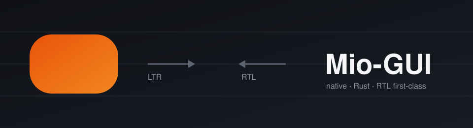

<div align="center">
  
</div>

<div align="center">


</div>

# Mio-GUI

A native, cross-platform Rust GUI framework where **RTL and LTR are equal, first-class layout directions** — not an afterthought bolted onto a left-to-right engine.

No browser. No WebView. Windows, Linux, and macOS rendering through `wgpu`, with `cosmic-text` doing Unicode-correct text shaping underneath. [DaisyUI](https://daisyui.com) is the reference for *what components exist and what they're called* — not a dependency, not a CSS engine to reimplement.

```
cargo run --example rounded_rectangle
```

That's the whole framework today: one window, one analytically-antialiased rounded rectangle, driven entirely from Rust-side parameters. Everything below is what it's built to become.

---

## Why this exists

Most cross-platform GUI toolkits treat RTL as a CSS `direction: rtl` afterthought — mirror the flexbox, hope the icons don't look backwards. Mio-GUI inverts that: **direction is cascading state that every primitive, layout rule, and widget resolves through from the start**, the same way font size or theme resolves. Logical `start`/`end` internally, physical left/right only at the render boundary. See [`docs/decisions/0002-direction-model.md`](docs/decisions/0002-direction-model.md).

## Architecture

```mermaid
flowchart TB
    subgraph platform["Platform layer"]
        winit["winit — window & input"]
    end

    subgraph render["Renderer"]
        wgpu["wgpu — Vulkan / Metal / D3D12"]
        wgsl["WGSL shaders — analytic SDF primitives"]
        atlas["glyph atlas"]
    end

    subgraph text["Text system"]
        cosmic["cosmic-text — shaping & layout"]
        bidi["Unicode bidi resolution"]
    end

    subgraph layout["Layout"]
        direction["Direction::Ltr / Direction::Rtl — cascading"]
        geometry["logical → physical geometry"]
    end

    subgraph widgets["Widgets"]
        tree["retained widget tree, hit-testing, events"]
        daisy["DaisyUI-vocabulary components (not started)"]
    end

    winit --> wgpu
    wgpu --> wgsl
    cosmic --> atlas
    atlas --> wgsl
    text --> layout
    layout --> widgets
    direction -.cascades into.-> geometry
    geometry -.resolves into.-> wgsl

    style daisy fill:#1f1300,stroke:#e9540b,stroke-dasharray: 4 3
```



Solid boxes exist today. Layout (Phase 3) and the widget tree's hit-testing/event runtime (Phase 4) are both fully implemented and gated closed. DaisyUI-vocabulary components (dashed) are not yet started.

## Where things stand

Progress below is computed straight from the checkboxes in [`ROADMAP.md`](ROADMAP.md), not vibes.

| Phase | Focus | Progress |
|---|---|---|
| 0 | Engineering baseline (CI, lints, MSRV, ADRs) |  |
| 1 | Window + renderer foundation, rounded-rect primitive |  |
| 2 | Text & font system (`cosmic-text`, bidi, shaping) |  |
| 3 | Core geometry & direction-aware layout |  |
| 4 | Widget tree, hit-testing, events |  |
| 5 | Focus, keyboard, accessibility |  |
| 6 | Theme & style tokens |  |
| 7 | Foundational widgets |  |
| 8 | DaisyUI-vocabulary component coverage |  |
| 9 | Data-intensive app components |  |
| 10 | Performance & reliability |  |
| 11 | Public API & distribution |  |

Phases are gated — Phase *n+1* doesn't get real attention until Phase *n*'s own gate checklist passes. Phase 2's text correctness gate is complete: deterministic bundled fallbacks, bidi shaping, RTL and LTR interaction geometry, IME state, clipboard integration, atlas management, and independent reference comparison are in. Phase 3's direction-aware geometry and layout gate is also complete: cascading `Direction::Ltr`/`Rtl`, row/column layout, gap/padding/margin/alignment, RTL-mirrored placement, and nested-direction resolution are all implemented and tested. Phase 4's retained widget tree, frozen frame snapshots, invalidation, hit-testing, pointer interaction, and nested event flow are complete and tested across simulated resize and DPI transitions. Phase 5 (focus, keyboard, and accessibility) is now the active implementation front, while Phase 1's remaining cross-platform renderer checks stay visible.

## What's actually implemented right now

- A `winit`-driven window with typed, non-panicking error handling on window/adapter/device failure ([`src/app.rs`](src/app.rs))
- A batched `wgpu` render pipeline drawing analytic rounded rectangles with independent corner radii, inward borders, sub-pixel and fractional-scale-factor correctness, and derivative-based antialiasing ([`src/renderer.rs`](src/renderer.rs), [`docs/geometry.md`](docs/geometry.md))
- Coalesced resize handling — a burst of `Resized` events collapses into a single surface reconfigure against the latest size, instead of one expensive reconfigure per event
- CPU-vs-GPU golden-image testing for the rounded-rect primitive across radii and scale factors ([`tests/goldens/`](tests/goldens/), [`docs/render-testing.md`](docs/render-testing.md))
- `cosmic-text` integration with Unicode bidi shaping, RTL/LTR interaction geometry, bounded shape and raster caches, a GPU glyph atlas, bundled Vazirmatn and deterministic Noto fallbacks, locale-explicit digit formatting, IME state, and clipboard operations ([`src/text.rs`](src/text.rs), [`src/text_edit.rs`](src/text_edit.rs), [`src/digit_format.rs`](src/digit_format.rs), [`src/clipboard.rs`](src/clipboard.rs), [`assets/fonts/`](assets/fonts/))
- Direction-neutral core geometry — point, size, rectangle, edges, constraints, and transforms, with logical/physical coordinate separation and defined layout-to-render rounding rules ([`src/geometry.rs`](src/geometry.rs), [`docs/geometry.md`](docs/geometry.md))
- Direction-aware row/column layout — cascading `Direction::Ltr`/`Rtl`, gap, padding, margin, min/max size, alignment, and RTL-mirrored placement without reversing semantic child order ([`src/layout.rs`](src/layout.rs), [`src/linear_layout.rs`](src/linear_layout.rs), [`docs/layout.md`](docs/layout.md))
- A retained widget tree with stable widget identity, frozen frame snapshots, invalidation, hit-testing, pointer interaction, and nested event flow — Phase 4's full runtime, tested across simulated resize and DPI transitions ([`src/widget_tree.rs`](src/widget_tree.rs), [`src/frame.rs`](src/frame.rs), [`src/event.rs`](src/event.rs), [`src/interaction.rs`](src/interaction.rs), [`src/update.rs`](src/update.rs))
- A documented diagnostics path (`MIO_GUI_DIAGNOSTICS=1`) for surface lifecycle and presentation timing, used to debug real resize/maximize behavior across Ubuntu and macOS ([`docs/window-resize.md`](docs/window-resize.md), [`docs/errors-and-diagnostics.md`](docs/errors-and-diagnostics.md))

## Not yet — by design

Focus, keyboard handling, accessibility, theming, and every DaisyUI-vocabulary component are **deliberately unstarted**. The project principle is: concrete use cases pull features into scope, not the other way around ([`docs/decisions/0003-reference-scope.md`](docs/decisions/0003-reference-scope.md)). A component only gets promoted to stable after it satisfies direction, keyboard, accessibility, theme, and visual-regression checks — not before.

## Tech stack

| | |
|---|---|
| **Windowing & input** | [`winit`](https://github.com/rust-windowing/winit) `0.30.13` |
| **GPU rendering** | [`wgpu`](https://github.com/gfx-rs/wgpu) `30.0.0` — Vulkan / Metal / Direct3D 12 |
| **Text shaping** | [`cosmic-text`](https://github.com/pop-os/cosmic-text) `0.15.0` |
| **Shaders** | Hand-written WGSL, analytic SDF primitives |
| **MSRV** | `1.87`, pinned via [`rust-toolchain.toml`](rust-toolchain.toml) |
| **Dependencies** | Exact-pinned, `Cargo.lock` committed — see [`docs/dependency-policy.md`](docs/dependency-policy.md) |

## Getting started

```bash
git clone https://github.com/RezaRasoulzadeh/mio-gui.git
cd mio-gui
cargo run --example rounded_rectangle
```

Run the test suite (unit tests, CPU-reference geometry tests, and GPU golden-image comparisons where an adapter is available):

```bash
cargo test
```

Enable resize/presentation diagnostics on stderr:

```bash
MIO_GUI_DIAGNOSTICS=1 cargo run --example rounded_rectangle
```

## Documentation map

- [`ROADMAP.md`](ROADMAP.md) — the full phased checklist this README is generated from
- [`docs/geometry.md`](docs/geometry.md) — pixel conventions, rectangle boundaries, rounding rules
- [`docs/renderer-support.md`](docs/renderer-support.md) — backend targets, adapter policy, presentation modes
- [`docs/window-resize.md`](docs/window-resize.md) — measured resize/maximize behavior per platform
- [`docs/errors-and-diagnostics.md`](docs/errors-and-diagnostics.md) — error-handling and diagnostics policy
- [`docs/dependency-policy.md`](docs/dependency-policy.md) — how and why dependencies are pinned
- [`docs/decisions/`](docs/decisions/) — architecture decision records

## Project principles

- Rust-native rendering, no browser or WebView dependency
- Windows, Linux, and macOS as first-class targets, not one primary platform plus ports
- RTL and LTR are equal, cascading layout directions — inheritable, overridable, nestable
- Rendering primitives stay direction-neutral; layout resolves logical `start`/`end` before geometry reaches the renderer
- Mixed-direction text is shaped by a Unicode-compliant engine, not approximated
- Concrete application use cases pull features into scope before speculative framework work
- Every primitive ships with automated tests and an explicit acceptance gate

## License

Licensed under either of [MIT](LICENSE-MIT) or [Apache License 2.0](LICENSE-APACHE) at your option. Copyright retained by Reza Rasoulzadeh; the copyright notice must be kept in any copy or redistribution of this work.

## Status

Pre-alpha. APIs, the single public example, and the module layout will all move without notice until Phase 1 is formally gated closed. Not published to crates.io.